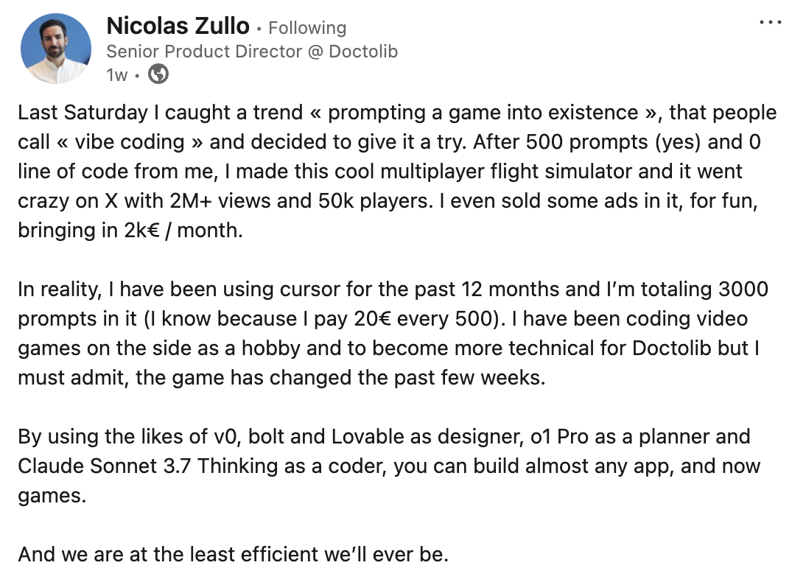
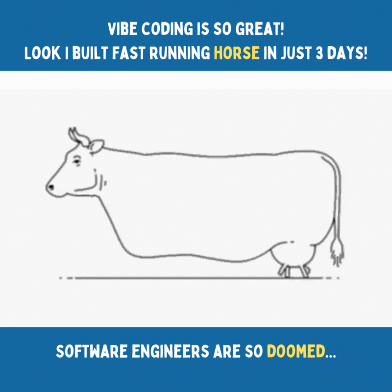
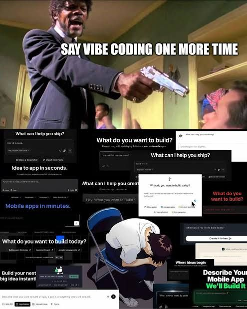

# My Vibe Coding Adventure: Building a Note-Taking App with AI

Ever heard of **vibe coding**? You just give instructions to AI assistants like Grok and Claude and they build all the code based on your requirements. I stumbled across a LinkedIn post by Nicolas Zullo, Senior Product Director at Doctolib.

[
](https://www.linkedin.com/posts/nicolaszullo_if-nicolas-zullo-can-build-a-flight-simulator-activity-7306820500293382145-cBMi/?utm_source=share&utm_medium=member_ios&rcm=ACoAAAUpDdcBzT3BrEqpOfotimxT7MTNkA_bIb8)

Nicolas produced a multiplayer flight simulator in a few hours without writing a single line of code. With 500 prompts he produced a game which had 2 million views on X and 50,000 players. He called it "vibe coding." I was impressed and wanted to give it a shot myself. I am currently working on [nexflow.it](https://nexflow.it)—a note-taking app which uses Generative AI to help you get organized. I thought, let's rebuild it from scratch using this approach. The note-taking app should support markdown, collaboration, media uploads, and an AI-powered "Chief of Staff" feature—using vibe coding. Spoiler: It was a blast, a mess, and a learning curve all rolled into one—a fascinating learning experience.

There is a high risk of ending up with a result like this:

[](https://www.linkedin.com/posts/pavel-polcr_vibe-coding-is-all-fun-and-games-until-activity-7307838241221550080-ydBb?utm_source=share&utm_medium=member_ios&rcm=ACoAAAUpDdcBzT3BrEqpOfotimxT7MTNkA_bIb8)

## The Project

My goal was a note-taking app that feels like scribbling in a personal notebook—intimate, secure, and intuitive. With markdown formatting, a slash command menu (type `/` for options), @mentions for collaboration, and media previews for images and PDFs. An LLM would auto-tag content (projects, people, etc.), and a "Chief of Staff" feature would schedule meetings to organize your week. Inspired by Zullo's success, I leaned on AI tools—**Grok 3 Think** and **Claude 3.7 Sonnet Thinking**—to design and build it in the Cursor IDE. Could vibe coding make this dream a reality? Let's find out.

## The Process

### Step 1: Designing with Grok

I kicked things off by texting Grok 3 Think on my phone during spare moments. My first prompt: _"Write a Product Design Document (PDD) in markdown for a note-taking app…"_ (see the full prompt in my GitHub repo—link at the end). In no time, Grok wrote out a detailed PDD with features like markdown support, real-time collaboration, and automatic tagging.

Next, I asked, _"Propose the simplest yet most robust tech stack."_ Grok's first attempt was solid but missed the editor component and ignored my AWS preference. After a few follow-ups (_"Add an editor!" "Make it AWS-centric!"_), we landed on **Next.js**, **Tiptap** (editor), **Yjs** (collaboration), and **AWS Amplify**. To keep things tidy, I had Grok create **Architecture Decision Records (ADRs)** for each tech choice. These mini-docs justified decisions like using DynamoDB or S3—great for transparency. After two days and a long chat, I had a PDD and 16 ADRs, all refined through casual back-and-forth. I ran into some smaller issues. The app should follow a local-first approach and yet support real-time collaboration. Yjs comes with a strong conflict-resolution but Grok insisted at first to build your own conflict-resolution. After a couple of attempts, we jointly found a good approach that relies on Yjs and includes a WebSocket-based server to support the real-time collaboration.

**Time spent:** 2 days of phone texting. That's a full design and architecture in less time than it takes to binge a Netflix series!

### Step 2: Summarizing with Claude

With my PDD and ADRs in hand, I turned to **Claude 3.7 Sonnet Thinking** in the Cursor IDE. I asked it to _"Write a tech-stack.md file summarizing the ADRs."_ I pointed Claude to my ADR folder, and it produced a neat summary (`tech-stack.md`). It included some incorrect decisions that were not part of the ADRs—but a second run with specific pointers fixed it.

Then, I asked Grok to craft 10 rules for Cursor to follow during development, emphasizing modularity to avoid a monolithic mess. Example rule: _"Break features into multiple files—don't let me wake up to a 1,000-line monster!"_ I moved all of these rules into `.cursor/rules`.

### Step 3: Planning the Build

I uploaded my PDD, tech stack, and rules to Grok and said, _"Create a detailed implementation plan with small, testable steps."_ The result (`implementation-plan.md`) was a 37-step roadmap—think "Initialize Next.js" to "Add Note Version History." I dropped it into an `app-design` folder with the PDD and asked Claude, _"Is this clear? What's confusing?"_ Claude fired back questions like, _"What should the schema look like? What metadata would you like to store?"_ I asked Grok to answer the questions and provided these responses to Claude again. After some ping-pong, the plan was airtight.

### Step 4: Building with Claude

Here's where vibe coding got real. For each step, I opened a new chat with Claude in Cursor and prompted:

> "Read all docs in @app-design, proceed with Step 1 of the implementation plan. I'll run the tests. Don't move to Step 2 until I validate. Then document in @progress.md and explain files in @architecture.md."

Claude read everything, gave me CLI commands (e.g., `npx create-next-app@latest`), and built files step-by-step. After I validated tests, it updated `progress.md` (e.g., "Initialized Next.js on 2025-03-19") and `architecture.md` (e.g., "`page.tsx`: Home page component"). It was like having a tireless intern who never sleeps but occasionally needs a nudge—an intern, not a Senior Developer.

## The Good

- **Time Savings (50-80%):** Claude wrote most of the code, slashing my workload. Even when it stumbled, guiding it beat solo debugging.
- **Structured Code (Mostly):** The modularity rule paid off—files stayed clean and manageable.
- **Documentation Gold:** Vibe coding birthed `progress.md` and `architecture.md`, tracking every move. I've never had docs this good—it's like **documentation-driven development**!

## The Bad

Not all was smooth sailing. I had moments of frustration:

[](https://www.linkedin.com/posts/vishakhhegde_some-personal-thoughts-about-ai-and-how-activity-7307407869463646208-raUg/?utm_source=share&utm_medium=member_ios&rcm=ACoAAAUpDdcBzT3BrEqpOfotimxT7MTNkA_bIb8)

We've all been there before—when we run into issues, debug like crazy for hours or even days, and can't get to the root cause of the problem. So, nothing new, yet the output of new features produced is worth the approach.

In my project, the slash command menu (`slash-command.ts`) was a beast. Tiptap's custom extensions are powerful but lean on ProseMirror's dense docs. Claude struggled, and I spent 2-3 hours tweaking prompts like:

> "The component's stable, but: 1/ Arrow keys don't stick—the selection jumps back. 2/ Escape should delete the slash and text."

Eventually, we nailed it. Here's a snippet from `slash-command.ts` that Claude produced after iterations:

```typescript
if (event.key === "Escape") {
  const slashPos = this.storage.slashPos;
  const currentPos = this.editor.state.selection.from;
  if (slashPos >= 0 && currentPos > slashPos) {
    this.editor.chain().focus().deleteRange({ from: slashPos, to: currentPos }).run();
  }
  this.storage.isActive = false;
  return true;
}
```

It deletes the slash command text and closes the menu—sweet victory! Still, those hours felt like herding a digital cat.

## The Ugly

Vibe coding has its quirks. Sometimes, Claude's code was gibberish—like it was written in Klingon. I'd tweak it (e.g., swapping straight lines for hand-drawn ones to mimic a notebook), only for Claude to overwrite my changes in the next chat. Lesson learned: Fresh chats are key after manual edits. And the ProseMirror docs? A labyrinth. Guiding Claude through them was like teaching a toddler rocket science—funny in hindsight, frustrating in the moment. And, at some point you think:

[](https://www.linkedin.com/posts/arfathae_if-youre-not-living-under-a-rock-youve-activity-7307415512114679808-qIsj/?utm_source=share&utm_medium=member_ios&rcm=ACoAAAUpDdcBzT3BrEqpOfotimxT7MTNkA_bIb8)

## Conclusion

Would I vibe code again? **Heck yes—with caveats.** It saved me tons of time, produced (mostly) solid code, and gave me documentation I'd never write solo. But it's not autopilot—you're the pilot, and the AI's your co-pilot who occasionally spills coffee on the controls.

**Tips for You:**

- Start small—test vibe coding on a tiny project first.
- Embrace the docs—it's your superpower.
- Be patient—think of AI as a keen intern, not a senior dev.

Check out my GitHub repo for the PDD, ADRs, and code. Have you tried vibe coding? Share your wins—or epic AI fails. Let's laugh and learn together!

---

## Sources

- [GitHub repo of my vibe coding session](https://github.com/nxsflow/vibe-coding)
- [Nicolas Zullo – Vibe Coding A Flight Simulator](https://www.linkedin.com/posts/nicolaszullo_if-nicolas-zullo-can-build-a-flight-simulator-activity-7306820500293382145-cBMi/?utm_source=share&utm_medium=member_ios&rcm=ACoAAAUpDdcBzT3BrEqpOfotimxT7MTNkA_bIb8)
- [Nicolas Zullo's approach to vibe coding was the inspiration for my own journey and this blog post](https://github.com/EnzeD/vibe-coding)
- [Pavel Polcr – I Built A Fast Running Horse In Just 3 Days](https://www.linkedin.com/posts/pavel-polcr_vibe-coding-is-all-fun-and-games-until-activity-7307838241221550080-ydBb?utm_source=share&utm_medium=member_ios&rcm=ACoAAAUpDdcBzT3BrEqpOfotimxT7MTNkA_bIb8)
- [Vishakh Hegde's personal thoughts about AI and how it changes the way we work](https://www.linkedin.com/posts/vishakhhegde_some-personal-thoughts-about-ai-and-how-activity-7307407869463646208-raUg/?utm_source=share&utm_medium=member_ios&rcm=ACoAAAUpDdcBzT3BrEqpOfotimxT7MTNkA_bIb8)
- [Arfath M.'s take on vibe coding](https://www.linkedin.com/posts/arfathae_if-youre-not-living-under-a-rock-youve-activity-7307415512114679808-qIsj/?utm_source=share&utm_medium=member_ios&rcm=ACoAAAUpDdcBzT3BrEqpOfotimxT7MTNkA_bIb8)

## About the Author

Carsten Koch works at AWS. He brings 20+ years of IT experience, started coding at the age of 11, and dug into productivity methods and tools as a teenager. He now builds [nexflow.it](https://nexflow.it)–a note taking app with AI as a first citizen. Sign up for the waitlist.
